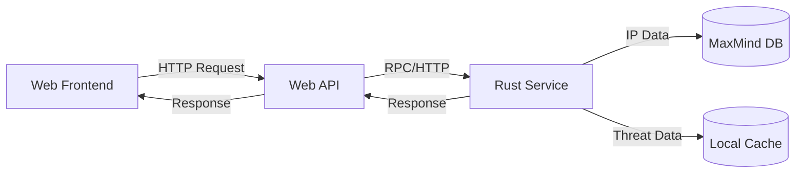

# IP Lookup System Overview

## System Architecture

The IP Lookup System is a distributed application consisting of three main components:

1. **Web Frontend** (React/TypeScript)
   - Handles user interactions
   - Makes API requests to the backend
   - Displays IP lookup results

2. **Web API** (Node.js/Express)
   - Provides RESTful endpoints
   - Handles request validation
   - Communicates with the Rust service
   - Transforms responses for the frontend

3. **Rust Service**
   - Performs core IP lookups
   - Manages IP databases
   - Implements threat scoring
   - Handles caching

## Data Flow

## Key Features

- **IP Geolocation**: Determine the physical location of an IP address
- **Threat Detection**: Identify VPNs, proxies, and TOR exit nodes
- **ASN Lookup**: Get autonomous system information
- **Caching**: Improve performance with in-memory caching
- **Background Updates**: Keep threat data current

## Security Considerations

- API key authentication
- Input validation
- Rate limiting
- Secure header handling
- Error handling without information leakage

## Performance

- In-memory radix trees for fast lookups
- Asynchronous processing
- Configurable caching
- Efficient data structures
